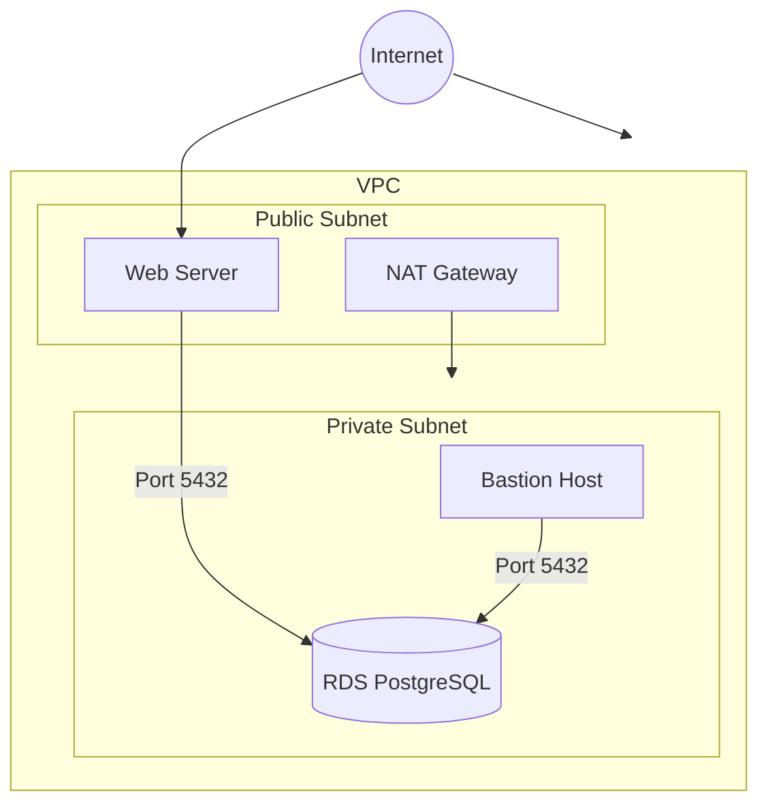

# aws-demo

## Getting Started

https://docs.aws.amazon.com/cdk/v2/guide/hello_world.html

## Architecture



## Bootstrap

```bash
npx cdk bootstrap
```

## Deploy

```bash
npx cdk deploy
```

## Destroy

```bash
npx cdk destroy
```

## Connect to RDS

```bash
INSTANCE=i-03b3b80794bb91296
ENDPOINT=awsdemostack-databaseb269d8bb-chjer1oo2ode.c3mmk408cu5t.us-east-1.rds.amazonaws.com

aws ssm start-session \
    --target "$INSTANCE" \
    --document-name "AWS-StartPortForwardingSessionToRemoteHost" \
    --parameters "portNumber=5432,localPortNumber=5432,host=$ENDPOINT" \
    --region "us-east-1"
```

## Outputs

```bash
AwsDemoStack.BastionInstanceId = i-03b3b80794bb91296
AwsDemoStack.DatabaseEndpoint = awsdemostack-databaseb269d8bb-chjer1oo2ode.c3mmk408cu5t.us-east-1.rds.amazonaws.com
AwsDemoStack.WebServerPublicIP = 54.167.126.45
```

## Cost

The estimated monthly cost for running this AWS infrastructure is approximately $59.21. This includes:

- **EC2 Instances**: $12.10
- **RDS Instance**: $12.41
- **NAT Gateway**: $32.40
- **RDS Storage**: $2.30

Please note that these are estimated costs and actual costs may vary based on usage and AWS pricing changes.

Use <https://calculator.aws/#/> to calculate costs for different configurations.

## Cost Saving Thoughts

A good example of how AWS can save costs in a typical three-tier (presentation, application, and data layers) stack is by leveraging its scalable, managed, and serverless services to optimize resource usage and reduce operational overhead.

### Presentation Layer

- Instead of Ec2 use S3 and CloudFront for static content.

### Application Layer

- Use AWS Lambda for compute tasks

### Data Layer

- If you can use DynamoDB instead of RDS.
- For fluctuating workloads use Amazon Aurora Serverless.

### Additional Cost Saving Tips

- Auto Scaling Groups
- Spot Instances and Savings Plans
- AWS Cost Explorer and Budgets
