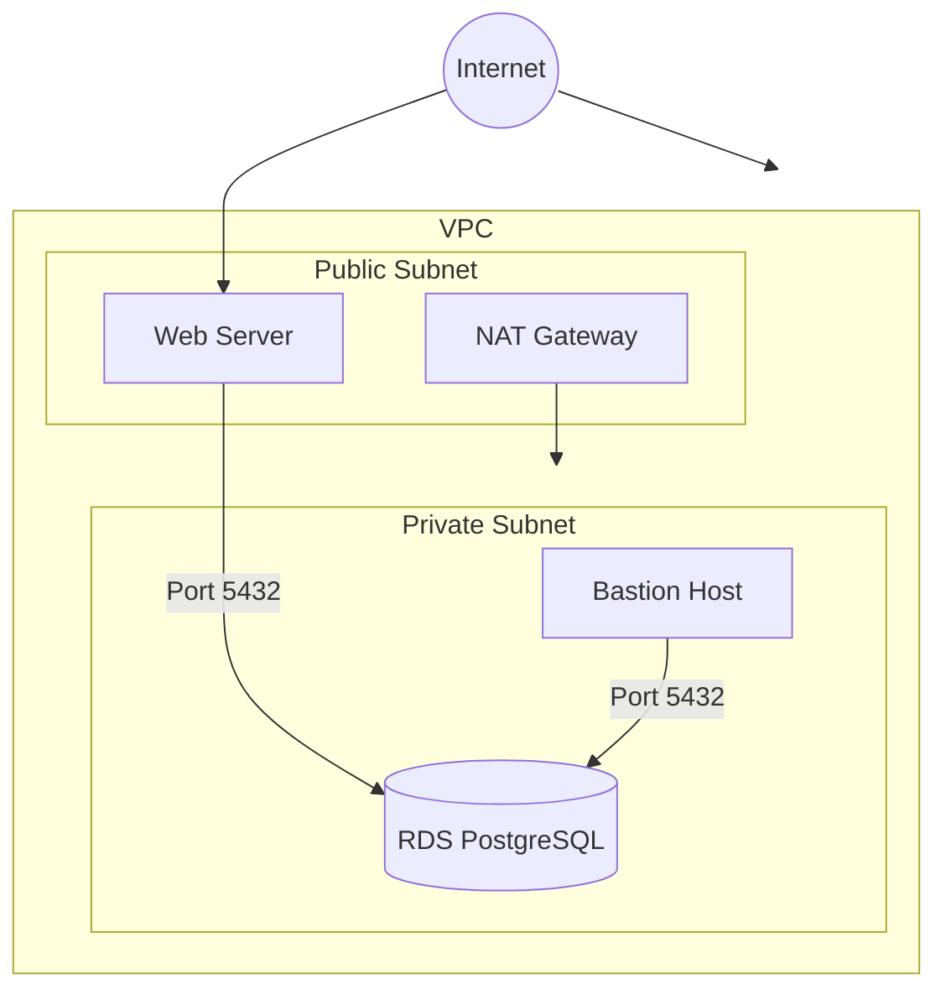

# aws-demo

## Getting Started

https://docs.aws.amazon.com/cdk/v2/guide/hello_world.html

## Architecture



## Bootstrap

```bash
npx cdk bootstrap
```

## Deploy

```bash
npx cdk deploy
```

## Connect to RDS

```bash
INSTANCE=
ENDPOINT=

aws ssm start-session \
    --target "$INSTANCE" \
    --document-name "AWS-StartPortForwardingSessionToRemoteHost" \
    --parameters "portNumber=5432,localPortNumber=5432,host=$ENDPOINT" \
    --region "us-east-1"
```

## Cost
